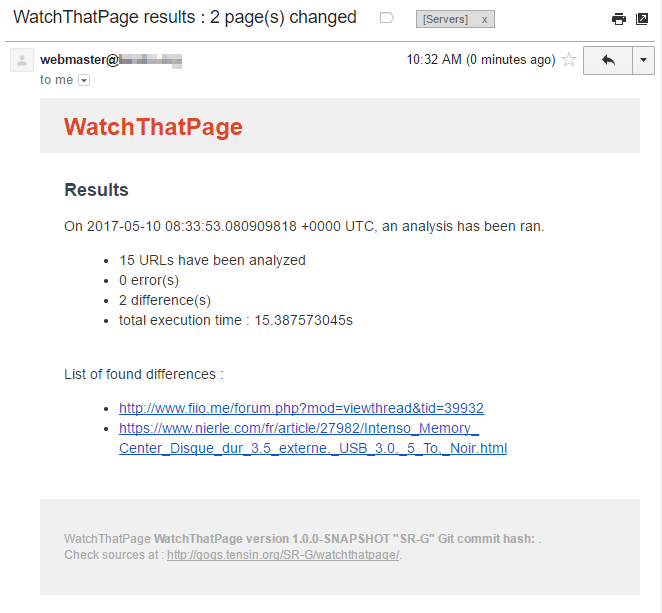

# watchthatpage

`watchthatpage` is a command line program that may trigger mail notifications when some changes are detected on remote web pages. Monitored URLs are customizable (as many as you want) - in addition, some selectors may be configured in order to extract, if needed, only some relevant part. Notification  mail are templated and are also configurable. Optionaly, some screenshots of website may be taken (with an external dependency, see examples).

## Examples 

### Usage

```bash
WatchThatPage is a command line program used to trigger notifications when some HTML page contents is modified

Usage:
  watchthatpage [command]

Available Commands:
  clean       Clean cached content
  grab        Grab pages
  help        Help about any command
  version     Print the version number of watchthatpage

Flags:
      --configuration string   Configuration file name. Default is binary name + .json (e.g. 'watchthatpage.json'), in the same folder than the binary itself (default "watchthatpage.json")
  -h, --help                   help for watchthatpage

Use "watchthatpage [command] --help" for more information about a command.
```

Example of output :

```bash
Configuration file found under [watchthatpage.json], now loading content
Configuration loaded with [3] urls, gzip [false], minify [true], auto backup [true], generate screenshots [true], sections to skip [script footer meta style map img nav select form noscript]
Now parsing URL [https://www.bostonglobe.com/news/bigpicture]
Now parsing URL [https://fr.wikipedia.org/wiki/Wikip%C3%A9dia:Accueil_principal]
Now parsing URL [https://news.google.com/news/?ned=fr&gl=FR&hl=fr]
Results : 
  - [DIFF]  URL [https://fr.wikipedia.org/wiki/Wikip%C3%A9dia:Accueil_principal], analysis took [11.884853454s], cached content [/mnt/internal/sata/downloads/downloaded/workspaces/go/watchthatpage/bin/linux/cache//3f7b7021cd0f50958448273113c2ea1e]
  - [DIFF]  URL [https://news.google.com/news/?ned=fr&gl=FR&hl=fr], analysis took [18.044830746s], cached content [/mnt/internal/sata/downloads/downloaded/workspaces/go/watchthatpage/bin/linux/cache//f3f1bce5db55b5e02b1479de568b0128]
  - [DIFF]  URL [https://www.bostonglobe.com/news/bigpicture], analysis took [22.10838874s], cached content [/mnt/internal/sata/downloads/downloaded/workspaces/go/watchthatpage/bin/linux/cache//ee545bc3b80dc0cd684453067b12527a]
Total execution time [22.10883423s], analyzed urls [3], errors [0], diffs [3]
Notifications to [......@gmail.com], from [webmaster@domain.tld], server [smtp.gmail.com:587], template [.../templates/multi-columns.tmpl]
(...)
```

Example of generated mail :



### Configuration

Example configuration :

```json
{
  "Urls" : [ 
	"https://asuswrt.lostrealm.ca/download",
	"http://www2.meethue.com/en-us/release-notes/accessories",
	"http://www2.meethue.com/en-us/release-notes/lamps",
	"http://www2.meethue.com/en-us/release-notes/bridge",
	"http://tim.blog/gear/"
  ],
  "Selectors" : {
	"http://www.fiio.me/forum.php?mod=viewthread&tid=39932" : { "Selector" : "td[id=postmessage_105396]", "SelectorsToSkip" : [ "ignore_js_op" ] }
  },
  "LogLevel" : "INFO",
  "Gzip" : false,
  "MinifyHTML" : true,
  "GenerateScreenshots" : true,
  "ScreenshotCommand" : "/usr/bin/docker run --rm -v ${cache}:/images kevinsimper/wkhtmltoimage --quality 75 --crop-h 720 --format jpg ${url} /images/${filename}.jpg",
  "NotificationMail" : { 
	"template" : "templates/mail.tmpl",
	"to" : "<recipient>@<domain.tld>",
	"from" : "<sender>@<domain.tld>",
	"subject" : "WatchThatPage results : {{ .NbDiff }} page(s) changed",
	"smtp-hostname" : "smtp.gmail.com",
	"smtp-tls" : true,
	"smtp-port" : 587,
	"smtp-login" : "<login>@<domain.tld>",
	"smtp-password" : "<password>"
  }
  ,
  "SectionsToSkip" : [ 
	"script", 
	"footer", 
	"meta", 
	"style", 
	"map",
	"img",
	"form",
	"noscript"
  ]
}
```

- **CacheDirectory** (optional, default is `cache/`) : defines where previous pages content will be stored
- **Gzip** (optional, false by default) : defines if cached content has to be gzipped in order to reduce space usage
- **MinifyHTML** (optional, false by default) : defines if retrieved HTML has to be minified (removal of whitespaces, ...)
- **SectionsToSkip** (optional, empty by default) : list of HTML tags that needs to be removed (should include tags that may be different at each page load) : `script`, `footer`, `meta`, `form`, `noscript`, `style` are good values to exclude
- **LogLevel** : not implemented at this time
- **NotificationMail** : which parameters to use for the mail notification
- **AutoBackup** (optional, false by default) : automatically creates a backup of the previous cache content (allows to manually review differences)
- **Urls** : URLs to grab (without additional customizations)
- **Selectors** : URLs to grab, but with additional selectors (to include one HTML entry to grab and/or to add exclusions)

	- **Selector** (optional) : the HTML entry to grab (example : `div[id=article_show_head_right]`) 
	- **SelectorsToSkip** (optional, list of string) : list of entries to remove

- **GenerateScreenshots** : (optional, false by default) should screenshots be generated or not - next parameter must then be configured
- **ScreenshotCommand** (optional, blank by default) : system command that will be executed in order to take screenshot of remote web pages. Examples may be :

	- execution through docker : `/usr/bin/docker run --rm --name wkhtmltoimage -v ${cache}:/images kevinsimper/wkhtmltoimage --quality 75 --crop-h 720 --format jpg ${url} /images/${filename}.jpg` (may be used exactly like that)
	- execution without docker : `wkhtmltoimage --quality 75 --crop-h 720 --format jpg ${url} <absolute-path-to-cache-directorty>/${filename}.jpg` (cache path has to be customized)
	
### Template

Available items are defined in the `results.go` file

- **NbUrls** (int) : number of configured / analyzed urls
- **NbDiff** (int) : numer of links containing differences with previous execution
- **NbErrors** (int) : number of errors found 
- **ExecutionTime** (string) : duration of the whole execution
- **Date** (string) : execution date
- **Version** (string) : program version
- **Results** (array or Result) : each individual result, whatever its state is (error, difference found, ...)

And for each result (in the `result.go` file) :

- **Url** (string) : the analyzed URL
- **Title** (string) : page title
- **Differences** (string) : description of found differences (in progress)
- **FirstExecution** (bool) : is it the first execution (in this case, nothing can be analyzed)
- **HasDifferences** (bool) : has this url any differences with previous execution
- **HasError** (bool) : is the analysis in error
- **Error** (string) : description of the encountered error
- **CacheFileName** (string) : name of the stored cache content
- **AnalysisExecutionTime** (time.Duration) : duration of the analysis of this url

Example of a basic template (has to be configured in the `json` configuration file) :

```html
<html>
<body>
<p>
On {{ .Date }}, {{ .NbUrls }} URLs have been analyzed - {{ .NbErrors }} error(s), {{ .NbDiff }} difference(s), execution time {{ .ExecutionTime }}.<br />
</p>

<p>
List of found differences :
</p>
<ul>
	{{ range .Results }}  
		{{ if .HasDifferences }}
			<li><a href="{{ .Url }}" target="_blank">{{ .Url }}</a></li>
		{{ end }}
	{{ end }}
</ul>

</body>
</html>
```

### Crontab

In order to have this process running each day, just put in the system crontab something like :

```crontab
30	06	*	*	*		/home/applications/watchthatpage/watchthatpage grab > /var/log/cron-watchthatpage.log 2>&1
```

Folder structure is dependant of the configuration (default configuration file in same folder - otherwise to be specified through the --configuration flag), templates path defined in JSON configuration.

```bash
cache
templates
watchthatpage
watchthatpage.json
```

## Links 

- cobra framework : https://github.com/spf13/cobra
- mail template borrowed from : https://github.com/InterNations/antwort
- documentation about parsing HTML : 
	- http://stackoverflow.com/questions/30109061/golang-parse-html-extract-all-content-with-body-body-tags
	- https://schier.co/blog/2015/04/26/a-simple-web-scraper-in-go.html
	- https://mionskowski.pl/html-golang-stream-processing

## Development

### Build

Init and build from host :

```bash
docker pull golang:alpine
docker run --rm -it -v $(pwd):/go golang go get -d ./...
docker run --rm -it -v $(pwd):/go golang go install tensin.org/watchthatpage
```

Work from inside a container :

```bash
docker run --rm -it -v $(pwd):/go golang /bin/bash
```

Build from alpine docker image (parameters are used to generate static and reduced binaries) : 

```bash
go install -ldflags "-d -s -w -X tensin.org/watchthatpage/core.Build=`git rev-parse HEAD`" -a -tags netgo -installsuffix netgo tensin.org/watchthatpage 
```

Cross-compile :

```bash
GOARCH=amd64 GOOS=windows go install ...
```

### Dependencies

```
github.com/PuerkitoBio/goquery
github.com/fatih/color
github.com/spf13/cobra
github.com/tdewolff/minify
github.com/tdewolff/minify/css
github.com/tdewolff/minify/html
github.com/tdewolff/minify/js
golang.org/x/net/html
```

```bash
grep -R -h "github" *|sort -u 
grep -R -h "golang" *|sort -u 
```

## TODO

### To add

- [x] Notifications : by mail
- [x] Comparing content : option to minify read content
- [x] Comparing content : configurable global exclusions (footer, header, ...)
- [x] Optimization : option to gzip saved content
- [x] Notifications : better default mail template
- [x] Optimization auto backup previous cache content (if configured)
- [x] Comparing content : optional selector for each url ("body.section", ...)
- [x] Notifications : try to screenshot webpage and include image in template (seems hard in pure go : done with external command)
- [ ] Notification : through MQTT
- [ ] Project : add a "serve" mode (running server), exposing REST services to add/update/delete/trigger configured URLs
- [ ] Comparing content : try to find a workaround for instagram pages
- [ ] Comparing content : section / article detection (to be used instead of body)
- [ ] Comparing content : try to compute real differences 
- [ ] Project : build, package and cross compile tooling 
- [ ] Project : code refactoring
	- [ ] use loggers
	- [ ] better separation of concerns between objects
	- [ ] add more tests

### Find a proper name

Keywords : 

```
watch
watch that page
explore
analyze
scrap
parse
diff
differences
delta
extract
read
```

